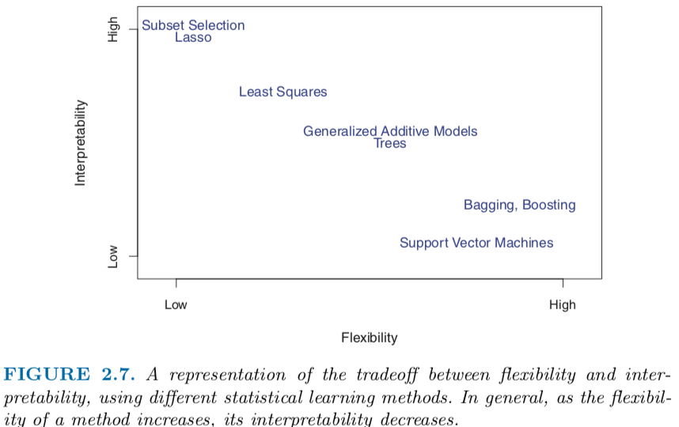

```{r setup, include=FALSE}
knitr::opts_chunk$set(echo = TRUE)
```

# Chapter 1 Introduction. 没有重要内容

# Chapter 2 Statistical Learning
## 2.1
### Definitions
  * X: Input variable ~ predictors ~ independent variables ~ features
  * Y: Output variable ~ response ~ dependent variable
  * $Y = f(X) + \epsilon$ <br>
      f: function of $X_1, ..., X_p$ <br>
      $\epsilon$: random error term, independent of X, mean 0.
     
### Estimate f: predition & inference
1.  **Prediction** 
* Error平均后是0，所以有$\hat{Y} = \hat{f}(X)$. 不关心$\hat{f}$的具体形式，作为黑匣子，只要对Y的预言准确。
* **Reducible error and irreducible error**: 可以通过优化$\hat{f}$消除reducible error, 但还是存在irreducible error.
* $E[(Y-\hat{Y})^2] = E[(f(X)+\epsilon - \hat{f}(X))^2] = E[(f(X)-\hat{f}(X))^2] + 2E[\epsilon(f(X)-\hat{f}(X))] + E[\epsilon ^ 2] = E[(f(X)-\hat{f}(X))^2] + Var(\epsilon)$.<br>
$\epsilon$与X无关且mean为0.
我们的目的是减小实际值$Y$与预言值$\hat{Y}$的expected value of squared difference. 由上面的展开式，是要减小$E[(f(X)-\hat{f}(X))^2]$.

2. **Inference**    
* 不能将$\hat{f}$作为黑匣子，必须理解每个$X_i$是如何影响$Y$的。
* 实际也可能综合predicition和inference。

### Parametric and Non-parametric Methods
1. **Parametric (Model-based)**
* 步骤：假定$f$形式；用training data to fit/train model to get parameters, eg: (ordinary) least squares.
* flexible models：需要的参数更多，可能overfitting.

2. **Non-parametric**
* estimate f, 避免选取f, 但需要大观测量。

### Tradeoff between Prediction Accuracy and Model interpretability


### Supervised VS. Unsupervised Learning
* 也有semi-supervised learning, 比如Y数量小于X样本数。本书不讨论。

### Regression VS. Classification
* 通常是Quantitative vs. qualitative (categorical), 但不总是。

## 2.2. Assssing Model Accuracy
1. **Regression**中
* Regression中，最常用Mean Squared Error: $MSE = \frac{1}{n}\sum\limits_{i=1}^n(y_i - \hat{f}(x_i))^2$
* 给定$x_0$, expected test MSE $E(y_0 - \hat{f}(x_0))^2$可以分解为：
$E(y_0 - \hat{f}(x_0))^2 = Var(\hat{f}(x_0)) + [Bias(\hat{f}(x_0))]^2 + Var(\epsilon)$.
由于variance和bias squared的非负性，$E(y_0 - \hat{f}(x_0))^2 \ge Var(\epsilon)$.
* 为了减小expected test error, 我们希望选取统计方法使得low variance & low bias.<br>
*Variance*: 使用不同的training data, 造成$\hat{f}$的差异。理想情况下，应该小。通常，more flexible method会有高variance.<br>
*Bias*: 模型与现实的差异，比如linear regression了一个nonlinear 问题。<br>
通常，more flexible methods -> high variance, low bias.

2. **Classification**中
* 修改下定义，使用error rate来衡量accuracy:
  $\frac{1}{n}\sum\limits_{i=1}^nI(y_i \neq \hat{y_i})$.
* 类似的，给定$x_0$，test error rate是$Ave(I(y_0 \neq \hat{y_0}))$.
* Bayes Classifier.<br>
  Bayes error rate: lowest possible test error rate, $1-E[\max_j Pr(Y=j|X)]$.
* kNN, k取值的影响。

## 2.3. R
*index连头带尾，比如A[1:3, ]输出三行
```{r}
A=matrix(1:16,4,4)
A[-c(1:2),] #-,不包括
```


